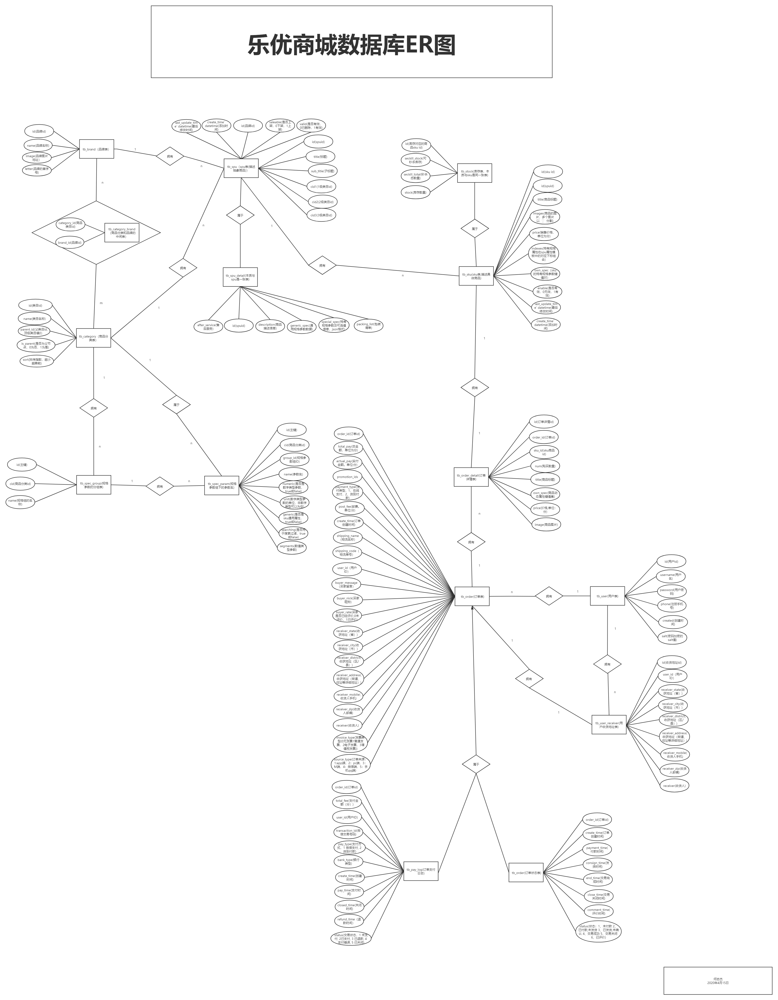

# leyou-shop

# 乐优商城

## 1项目介绍

- 乐优商城是一个全品类的电商购物网站（B2C）。
- 用户可以在线购买商品、加入购物车、下单
- 可以评论已购买商品
- 管理员可以在后台管理商品的上下架、促销活动
- 管理员可以监控商品销售状况
- 客服可以在后台处理退款操作

## 2系统架构

### 2.1.系统架构

整个乐优商城可以分为两部分：后台管理系统、前台门户系统。

- 后台管理：

  - 后台系统主要包含以下功能：
    - 商品管理，包括商品分类、品牌、商品规格等信息的管理
    - 销售管理，包括订单统计、订单退款处理、促销活动生成等
    - 用户管理，包括用户控制、冻结、解锁等
    - 权限管理，整个网站的权限控制，采用JWT鉴权方案，对用户及API进行权限控制
    - 统计，各种数据的统计分析展示
  - 后台系统会采用前后端分离开发，而且整个后台管理系统会使用Vue.js框架搭建出单页应用（SPA）。
  - 后端首页：

- 前台门户

  - 前台门户面向的是客户，包含与客户交互的一切功能。例如：
    - 搜索商品
    - 加入购物车
    - 下单
    - 评价商品等等
  - 前台系统使用Thymeleaf模板引擎技术来完成页面开发。出于SEO优化的考虑，将不采用单页应用。

  

无论是前台还是后台系统，都共享相同的微服务集群，包括：

- 商品微服务：商品及商品分类、品牌、库存等的服务
- 搜索微服务：实现搜索功能
- 订单微服务：实现订单相关
- 购物车微服务：实现购物车相关功能
- 用户中心：用户的登录注册等功能
- Eureka注册中心
- Zuul网关服务
- ...

# 2.技术选型

## 2.1.相关技术

前端技术：

- 基础的HTML、CSS、JavaScript（基于ES6标准）
- JQuery
- Vue.js 2.0以及基于Vue的框架：Vuetify（UI框架）
- 前端构建工具：WebPack
- 前端安装包工具：NPM
- Vue脚手架：Vue-cli
- Vue路由：vue-router
- ajax框架：axios
- 基于Vue的富文本框架：quill-editor 

后端技术：

- 基础的SpringMVC、Spring 5.x和MyBatis3
- Spring Boot  **2.2.5.RELEASE** 
- Spring Cloud 最新版  **Hoxton.SR3** 
- Redis-4.0 
- RabbitMQ-3.4
- Elasticsearch-6.3
- nginx-1.14.2
- FastDFS - 1.26.6-RELEASE
- MyCat
- Thymeleaf
- mysql   8.0.17
- Spring Data MongoDB

## 2.2.技术解读
以上技术组合在项目中解决以下电商中的典型问题：

- 利用Node.js及Vue.js技术栈，实现前后端分离开发

- 利用SpringCloud技术栈，实现真正的微服务实战开发，并且是基于SpringBoot2.2.5和SpringCloud最新版本Hoxton.SR3实现，业内领先。

- 贴近真实的电商数据库设计，解决全品类电商的SPU和SKU管理问题

- 基于FastDFS解决大数据量的分布式文件存储问题

- 基于Elasticsearch高级聚合功能，实现商品的智能过滤搜索

- 基于Elasticsearch高级聚合功能，实现销售业务的复杂统计及报表输出

- 基于LocalStorage实现离线客户端购物车，减轻服务端压力。

- 基于JWT技术及RSA非对称加密实现真正无状态的单点登录。

- 结合JWT和RSA非对称加密，自定义Feign过滤器实现自动化服务间鉴权，解决服务对外暴露的安全问题

- 基于阿里大于实现SMS功能，解决电商短信通知问题

- 基于RabbitMQ实现可靠消息服务，解决服务间通信问题

- 基于RabbitMQ实现可靠消息服务，解决分布式事务问题

- 使用微信SDK实现微信扫码支付，符合主流付款方式

- 基于Redis搭建高可用集群，实现可靠缓存服务即热点数据保存。

  redis持久化，集群，哨兵，主从，缓存击穿，热点key。

- 基于Redis和Mq来应对高可用高并发的秒杀场景

- 基于MyCat实现数据库的读写分离和分库分表

  发视频

- 基于Thymeleaf实现页面模板和静态化，提高页面响应速度和并发能力

- 基于Nginx实现初步的请求负载均衡和请求限流
## 2.2.开发环境

- IDE：IntelliJ IDEA 2019.1.3 x64 版本
- JDK： JDK1.8
- 项目构建：maven3.6.0
- 版本控制工具：git

## 2.3.域名

在开发的过程中，为了保证以后的生产、测试环境统一。都采用域名来访问项目。

一级域名：www.leyou.com，leyou.com leyou.cn 

二级域名：manage.leyou.com/item , api.leyou.com

通过switchhost工具来修改host对应的地址，把这些域名指向127.0.0.1，跟用localhost的效果是完全一样的。

## 2.4数据库
### 2.4.1ER图：

### 2.4.2数据库 : leyou
### 2.4.3数据库表 

**tb_user用户表**：					用户的基本信息

**tb_user_receiver 用户收货地址表**：	保存用户收货地址

**tb_spu SPU表**：	Standard Product Unit （标准产品单位） ，一组具有共同属性的商品集 

​		描述的是一个抽象性的商品

**tb_spu_detail** : 因为spu的一些信息内容过大，并不需要经常查询，为了方便对spu表进行优化，所以把对应的字段信息切割出来一张单独的表，但是它们公用一个主键，所以其本质上是同一张表。

**tb_sku  SKU表**：Stock Keeping Unit（库存量单位），SPU商品集因具体特性不同而细分的每个商品

​		表示具体的商品实体

**tb_stock 库存表**:  代表库存，秒杀库存等信息

​		因为sku库存的写操作会非常频繁，

**tb_spec_group  规格参数的分组表**：每个商品分类下有多个规格参数组

**tb_spec_param 规格参数**：	规格参数组下的参数名

**tb_brand 品牌表**: 					商品的品牌信息

**tb_category_brand  品牌与分类中间表** 

**tb_category 商品类目表** ：类目和商品(spu)是一对多关系，类目与品牌是多对多关系

**tb_order 订单表**：用户的订单信息

**tb_order_status 订单状态表**：订单的状态 本质与订单是同一个表

**tb_pay_log 订单支付日志表**： 记录订单的支付信息  本质与订单是同一个表

**tb_order_detail 订单详情表**：订单具体的商品信息sku
